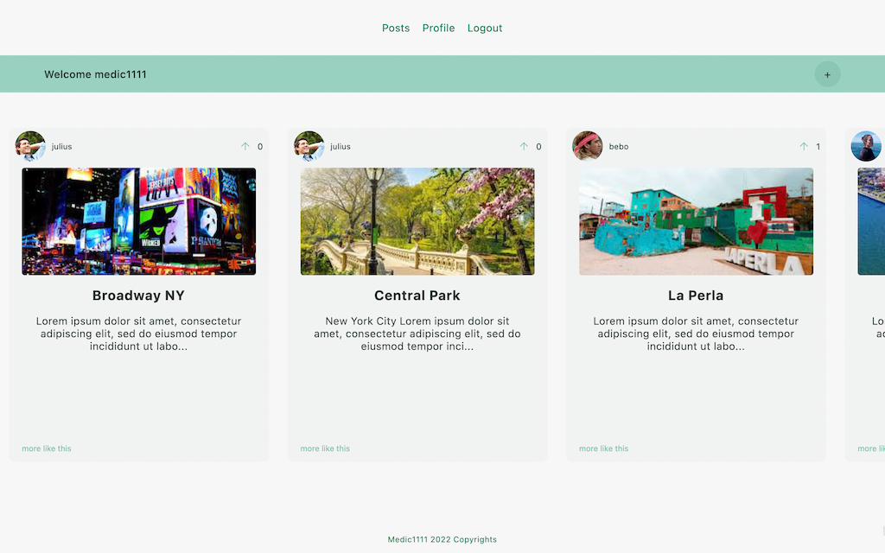

# NOMAD-ME

A travel style social media application contained to remain a non-toxic environment, with light-hearted feedback on user's activities

---

[LIVE MVP DEV HERE](https://nomad-2aix.onrender.com/)

testing credentials:

medic1111
111111

---

---

## The Story:

During my Chingu.io Voyage I was matched with a team of originally 4 developers. Facing life challenges we ended up completing the 6-week program in two, with a PERN Stack MVP delivered within the deadline. Although the mission was accomplished, I wanted to come up with a personal refactored version of it, built with MERN. [Here's the original](https://github.com/chingu-voyages/v40-bears-team-29) and it has a link to the live demo.

## Tech Stack

- Frontend
  - React/Typescript
  - CSS
- Backend
  - NodeJS
  - Express.js
- Database
  - MongoDB

## Status

- Currently in development, with code-cleaning in process, along with techniques for optimization

## Compromise

- Styling will not be the focus of this project

## Running it

- Fork/Clone this project
- Run `npm install` at the root to install server dependencies
- Run `cd client` followed by `npm install` to install client dependencies
- Create a `.env` file and add the following keys: `SECRET_TOKEN=AstringOfYourChoiCeNoQuotes`, `DB_URI=YourMongoUriNoQuotes`
- On the root, run `node server/app.js` or user nodemon alternatively
- Then in a second terminal run `cd client` and `npm start`
